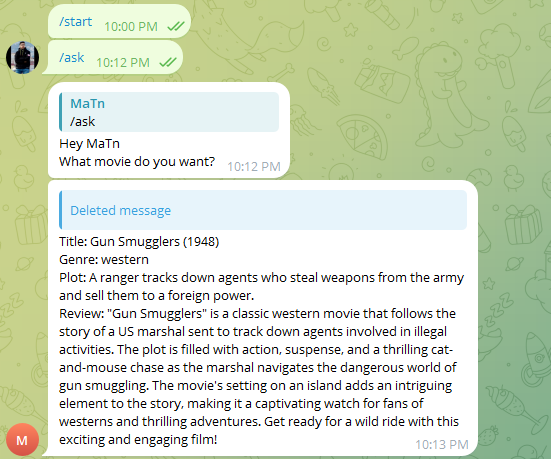
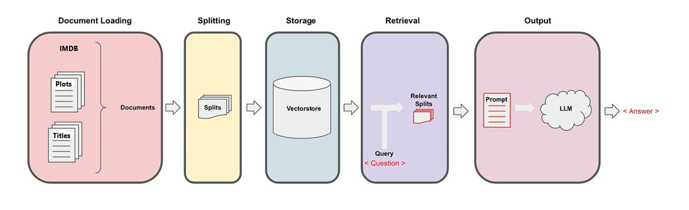

# Movie Retriever RAG

This is a RAG-based model for retrieving and recommending movies to users based on their description of a movie.


Overall structure of this model is shown below:


[Presentation Slides](https://docs.google.com/presentation/d/1bnuI5RUtohhFU1CeaE7XRRsO4Ij9ykPfOsgIR34GRsI/edit#slide=id.g2bf2fba26ac_2_61)

## Installations
Required packages are listed in requirements.txt file. You need to install them first:
```
pip install -r requirements.txt
```
It is highly recommended to run the project on google colab since it comes some pre installed packages.
Next, you have to enter your Telegram Bot Api Token in .env file. You can also change embedding model and LLM used in this project by making changes to this file. Your .env file should look something like this:
```
EMBEDDING_MODEL_NAME="thenlper/gte-base"
LLM_MODEL_NAME="HuggingFaceH4/zephyr-7b-beta"
BOT_TOKEN="YourBotAPIToken"
```

## Usage
### preparing data
you can downlaod the dataset in two ways:
- Get a kaggle api token and run `datasets/dowload.sh`
- download [Wikipedia Movie Plots](https://www.kaggle.com/datasets/jrobischon/wikipedia-movie-plots "Wikipedia Movie Plots") and [Persian movie dataset ](https://www.kaggle.com/datasets/mohammad26845/persian-movie-dataset-english-persian "Persian movie dataset ") and name them "english.csv" and "persian.csv"
After that prepare dataset by running `python dataset.py`

### creating vectorstore
In order to be able to compare documents with user query, a vectorstore should be built. you should run `python vectorizer.py` to do that.

### loading models and starting the bot
run `python bot.py`

# Evaluation

